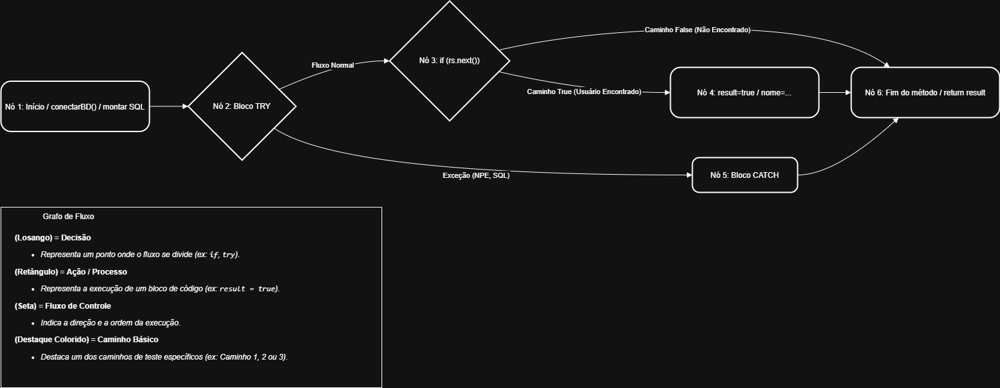

# Atividade-Individual-Caixa-Branca-249048 - Murilo Pires Andrade Cruz

Neste repositório, apresento minha análise estática e estrutural de uma classe Java (`User.java`), aplicando os conceitos de teste de caixa branca para identificar vulnerabilidades e definir uma estratégia de teste de ciclo.

---

## 1.  Etapa 1: Inspeção de Código (Análise Estática)

Iniciei o processo com uma revisão manual (inspeção estática) do arquivo `User.java`. O objetivo era identificar "code smells", vulnerabilidades e más práticas de design antes mesmo de executar o código.

A inspeção revelou rapidamente problemas estruturais graves:

* **Violação de Arquitetura:** A classe `User` (uma entidade) estava gerenciando conexões de BD, o que quebra o princípio da Separação de Camadas.
* **Vazamento de Recursos:** Nenhum dos objetos (`Connection`, `Statement`, `ResultSet`) estava sendo fechado com `.close()`, o que levaria ao esgotamento do pool de conexões.
* **Risco Crítico de NPE:** O método `conectarBD` retorna `null` em caso de falha, mas o método `verificarUsuario` não valida isso antes de usar a conexão.

### Planilha de Inspeção

Os 7 pontos de falha detalhados estão documentados na tabela abaixo:

| ID | ITEM | STATUS | ARTEFATO COM ERRO | ANÁLISE DO PROBLEMA |
| :--- | :--- | :--- | :--- | :--- |
| 1 | O código foi devidamente documentado? | **NÃO** | Métodos `conectarBD` e `verificarUsuario` | Faltam os comentários Javadoc para explicar o que cada método faz, seus parâmetros e seus retornos. |
| 2 | As variáveis e constantes possuem nomenclatura? | **NÃO** | Variáveis `st`, `rs`, `nome`, `result` | Nomes como `st` e `rs` são muito curtos. `nome` e `result` foram criadas no escopo global, mas só são usadas localmente. |
| 3 | Existem legibilidade e organização no código? | **NÃO** | Classe `User` | A organização está fraca. A classe `User` (que deveria guardar dados) está a misturar responsabilidades e a tentar gerir a conexão ao BD. |
| 4.1 | Todos os NullPointers foram tratados? | **NÃO** | Método `conectarBD` (Origem do Risco) | O método `conectarBD()` pode devolver `null` (se falhar), mas "engole" o erro no `catch` vazio, passando o risco para frente. |
| 4.2 | Todos os NullPointers foram tratados? | **NÃO** | Método `verificarUsuario` (Uso do Risco) | O código não verifica `if (conn != null)` antes de tentar usar a variável `conn` (que veio `null` do item 4.1). |
| 5.1 | As conexões utilizadas foram fechadas? | **NÃO** | Método `verificarUsuario` (Vazamento 1) | O objeto `Connection` (`conn`) é aberto, mas nunca é fechado com `.close()`. |
| 5.2 | As conexões utilizadas foram fechadas? | **NÃO** | Método `verificarUsuario` (Vazamento 2) | Os objetos `Statement` (`st`) e `ResultSet` (`rs`) também são abertos e nunca fechados. |

*(O arquivo-fonte desta planilha pode ser encontrado em: `public/MYP.jpg` e `ExercicioCaixaBranca(1).x`)*

---

## 2.  Etapa 2: Análise Estrutural e Ciclomática

Após a inspeção, mapeei o fluxo lógico do método `verificarUsuario()` para entender sua complexidade e definir quantos testes seriam necessários para uma cobertura completa.

### 2.1. Grafo de Fluxo de Controle (6 Nós)

O grafo abaixo (exportado da pasta `public/`) simplifica o método em 6 nós de decisão/ação.

### 2.2. Complexidade Ciclomática (V(G))

Para calcular o número mínimo de testes necessários, usei a fórmula de complexidade ciclomática:

$$V(G) = E - N + 2$$

Onde (para o grafo simplificado de 6 nós):
* **N (Nós):** 6
* **E (Arestas):** 7

**Cálculo:**
$$V(G) = 7 - 6 + 2 = 3$$

O resultado **V(G)=3** confirma que precisamos de **3 testes** para cobrir 100% dos caminhos lógicos do método.

### 2.3. Caminhos de Teste Identificados

Os 3 caminhos de teste independentes são:

1.  **Caminho de Sucesso:** O `try` funciona e o `if(rs.next())` é verdadeiro (usuário encontrado).
2.  **Caminho Normal:** O `try` funciona, mas o `if(rs.next())` é falso (usuário não encontrado).
3.  **Caminho de Exceção:** O `try` falha e o bloco `catch` é executado (ex: falha de conexão).

---
## 3.  Etapa 3: Validação Prática e Diagnóstico

A parte final foi validar a análise teórica. Adicionei um método `main` ao `User.java` original para forçar a execução dos 3 caminhos de teste.

### 3.1. Diagnóstico da Falha

O resultado foi conclusivo: **todos os 3 caminhos retornaram 'false'**. Até mesmo o "Caminho Feliz" (Teste 1) falhou.

Isso provou que a execução **nunca** chegava ao `if(rs.next())`, e que o **Caminho 3 (Exceção)** estava sempre sendo executado, mesmo quando o banco de dados estava "ligado".

Este teste validou perfeitamente as descobertas da Etapa 1 (Análise Estática):

> 1.  O `conectarBD()` falha ao tentar conectar (ex: senha `123456` errada).
> 2.  Por ter um `catch` vazio, ele "engole" o erro e retorna `null`.
> 3.  O `verificarUsuario()` recebe esse `null` na variável `conn`.
> 4.  A linha `conn.createStatement()` tenta usar o `null`, gerando um **`NullPointerException`**.
> 5.  Esse `NPE` é capturado pelo segundo `catch` (também vazio), e o método simplesmente termina, retornando seu valor padrão (`false`).

**Conclusão:** A análise prática confirmou que os blocos `catch` vazios e a falta de tratamento de `null` (identificados na inspeção estática) eram a causa raiz da falha total do método.

---

## 4. 🛠️ Códigos-Fonte

* **[Versão Original](versãoOriginal/User.java)**: O código-fonte defeituoso que foi alvo desta análise e teste.
* **[Versão Corrigida](VersãoCorrigida/User.java)**: O código que refatorei, usando `try-with-resources` e `PreparedStatement`.# Murilovers27-Atividade-Individual-Caixa-Branca-249048---Murilo-Pires-Andrade-Cruz
